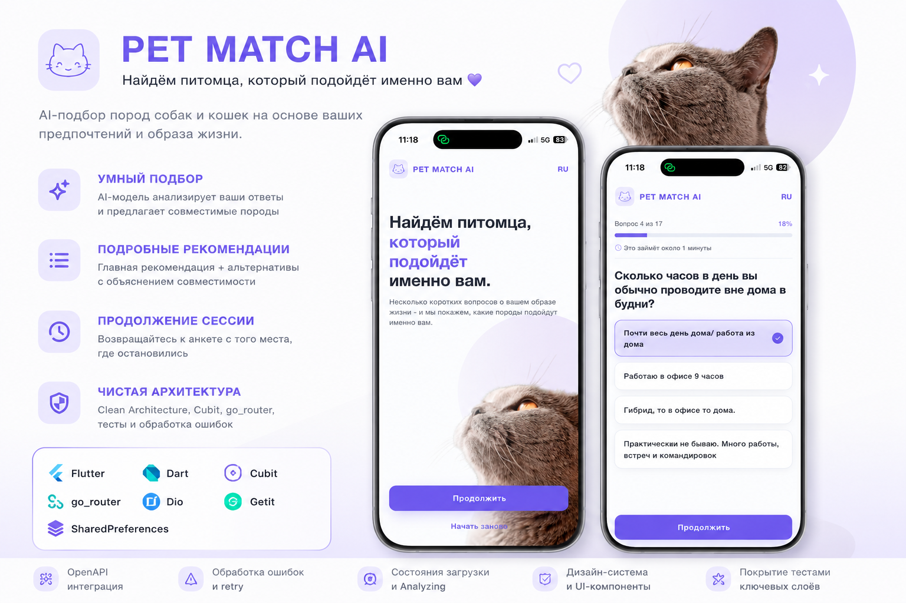

# Pet Match - Flutter

Flutter-приложение с Android-first фокусом, реализующее полный пользовательский сценарий Pet Match AI: Welcome, анкета, результаты совместимости, детали породы и галерея.

## Запуск

```bash
flutter pub get
flutter run
```

По умолчанию приложение запускается с реальным dev API.

Для запуска с конкретным `uid` из ТЗ:

```bash
flutter run --dart-define=PET_MATCH_EXTERNAL_ID=tester-12345
```

Для запуска с mock-данными:

```bash
flutter run --dart-define=USE_MOCK=true
```

Сборка APK:

```bash
flutter build apk --release
```

## Build-time флаги

| Флаг | По умолчанию | Назначение |
|---|---|---|
| `USE_MOCK` | `false` | `false` - реальный dev API, `true` - данные из `assets/mock/` |
| `API_BASE_URL` | `https://app-api.dev.pet-match.app/api/v1` | Базовый URL API |
| `PET_MATCH_EXTERNAL_ID` | пусто | Фиксированный `uid` для проверки resume-flow через dev API |
| `MOCK_FAIL_RATE` | `0` | Вероятность сетевой ошибки в mock-режиме |

## Архитектура

Проект построен по Clean Architecture: `data / domain / presentation` + `core`.

```
lib/
├── core/            DI, сеть, cache, дизайн-токены, shared-компоненты
├── data/            DTO, mappers, sources, repositories
├── domain/          entities, contracts, use cases
└── presentation/    router, cubits, screens, widgets
```

Ключевые практики:
- State management: `flutter_bloc` (Cubit).
- Навигация: `go_router`.
- DI: `get_it`.
- Типизированная обработка ошибок (`AppFailure`).
- Единая дизайн-система (`UiButton`, `UiCard`, `UiStateView`, токены).

## Качество

- Реализован полный flow согласно ТЗ.
- Поддержаны сценарии загрузки, ошибок и retry.
- Поддержан resume текущей сессии.
- Состояние подбора (`Analyzing`) встроено в пользовательский сценарий анкеты.
- Покрыты ключевые модули (роутер, Cubit, мапперы, shared UI, use-cases).

Проверки:

```bash
flutter analyze
flutter test
```

## Реализация

- По умолчанию приложение работает с реальным dev API (`USE_MOCK=false`).
- Mock-режим доступен для оффлайн-демо и тестирования через `--dart-define=USE_MOCK=true`.
- Polling совместимости встроен в flow анкеты и корректно доводит пользователя до результата.
- Android-сборка подготовлена для локальной проверки и ручного демо.

## Архитектурные акценты

- **Источник данных переключается build-флагом.** По умолчанию используется реальный dev API; mock-режим (`assets/mock/*.json`) подключается через `--dart-define=USE_MOCK=true` для offline-демо и тестов.
- **Polling совместимости встроен в анкету.** Финальное состояние подбора получаем через polling `GET /session` (интервал 3 с, общий таймаут 30 с) с отдельным промежуточным состоянием `Analyzing`.
- **State management.** Каждый Cubit отвечает за один экран; общая инфраструктура (`AppFailure`, дизайн-токены, маршруты, ассеты) централизована в `core/`.
- **Scope тестового задания.** Основной flow реализован полностью; feedback/post-result flow не добавлялся, так как он не требуется в ТЗ.

## Документация

- Архитектура и соответствие ТЗ: [docs/АРХИТЕКТУРА_И_СООТВЕТСТВИЕ_ТЗ.md](docs/АРХИТЕКТУРА_И_СООТВЕТСТВИЕ_ТЗ.md)
- Чек-лист ТЗ: [docs/tz-compliance.md](docs/tz-compliance.md)
- Дизайн-система: [docs/DESIGN_SYSTEM.md](docs/DESIGN_SYSTEM.md)

## Скриншоты


