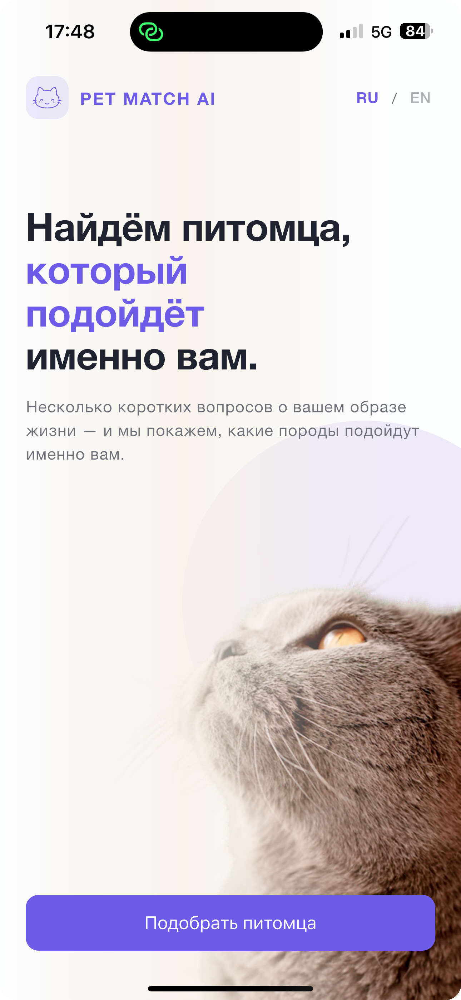
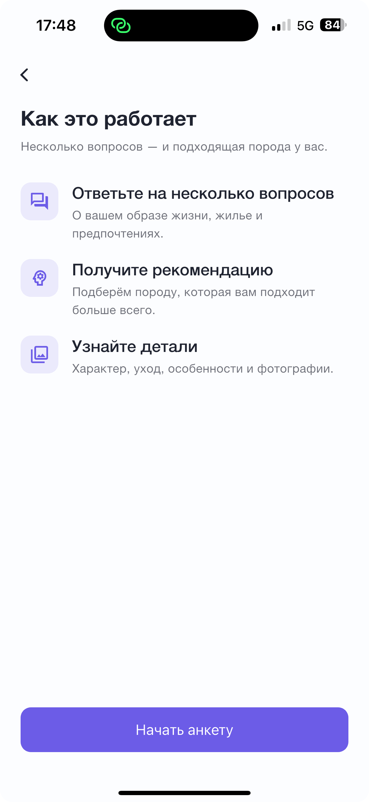
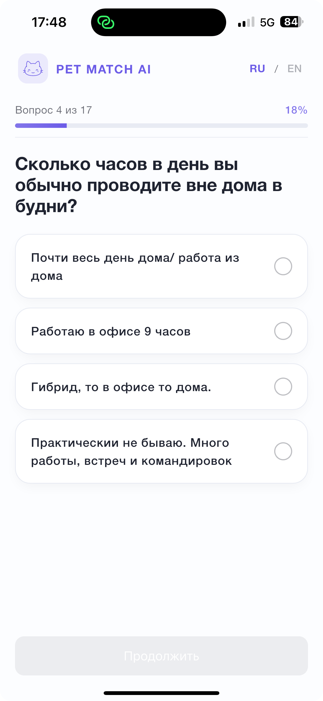
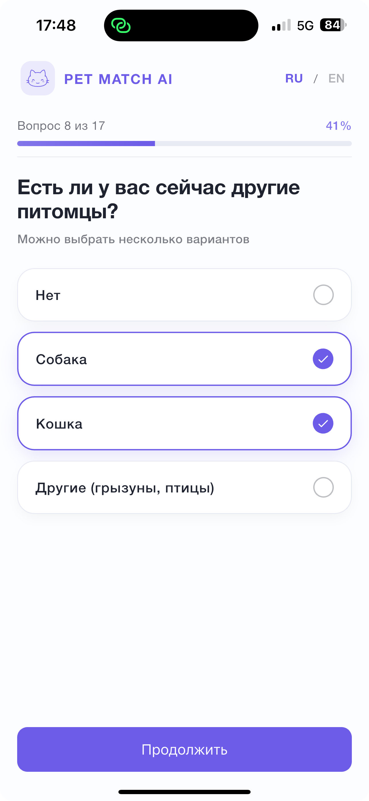

# Pet Match - Flutter

Flutter-приложение с Android-first фокусом, реализующее полный пользовательский сценарий Pet Match AI: Welcome, анкета, результаты совместимости, детали породы и галерея.

## Запуск

```bash
flutter pub get
flutter run
```

По умолчанию приложение запускается с реальным dev API.

Для запуска с mock-данными:

```bash
flutter run --dart-define=USE_MOCK=true
```

Сборка APK:

```bash
flutter build apk --release
```

## Build-time флаги

| Флаг | По умолчанию | Назначение |
|---|---|---|
| `USE_MOCK` | `false` | `false` - реальный dev API, `true` - данные из `assets/mock/` |
| `API_BASE_URL` | `https://app-api.dev.pet-match.app/api/v1` | Базовый URL API |
| `MOCK_FAIL_RATE` | `0` | Вероятность сетевой ошибки в mock-режиме |

## Архитектура

Проект построен по Clean Architecture: `data / domain / presentation` + `core`.

```
lib/
├── core/            DI, сеть, cache, дизайн-токены, shared-компоненты
├── data/            DTO, mappers, sources, repositories
├── domain/          entities, contracts, use cases
└── presentation/    router, cubits, screens, widgets
```

Ключевые практики:
- State management: `flutter_bloc` (Cubit).
- Навигация: `go_router`.
- DI: `get_it`.
- Типизированная обработка ошибок (`AppFailure`).
- Единая дизайн-система (`UiButton`, `UiCard`, `UiStateView`, токены).

## Качество

- Реализован полный flow согласно ТЗ.
- Поддержаны сценарии загрузки, ошибок и retry.
- Поддержан resume текущей сессии.
- Покрыты ключевые модули (роутер, Cubit, мапперы, shared UI, use-cases).

Проверки:

```bash
flutter analyze
flutter test
```

## Компромиссы и упрощения

- **Mock-источник как опция, не дефолт.** По умолчанию приложение ходит в реальный dev API (`USE_MOCK=false`). Mock доступен через `--dart-define=USE_MOCK=true` для оффлайн-демо и тестов.
- **EN-локализация — каркас.** Переключение языка и persist выбора через `SharedPreferences` работают, но строки переведены вручную через `LocalizedStrings` без `flutter_localizations`-ARB.
- **Release-сборка подписана debug-ключом.** `applicationId` — placeholder (`app.pet_match.pet_match`). Для публикации в сторе нужны реальный keystore и финальный package id.
- **Polling совместимости — фиксированный интервал 3 с.** Для прод-нагрузки имеет смысл экспоненциальный backoff.
- **Analyzing state встроен в `QuestionnaireCubit` как отдельное состояние**, отдельного роута `/analyzing` нет — так проще координировать polling и retry без второго экрана.

## Что улучшил бы следующим шагом

- Перевод строк на `flutter_localizations` + ARB-файлы для полноценной i18n.
- Подключение реального keystore + CI-сборка release APK.
- Crashlytics/Sentry для прод-логов.
- Локальный persist промежуточных ответов (сейчас resume полагается на бэк по `external_id`).
- Golden-тесты на ключевые экраны и e2e-flow.

## Документация

- Архитектура и соответствие ТЗ: [docs/АРХИТЕКТУРА_И_СООТВЕТСТВИЕ_ТЗ.md](docs/АРХИТЕКТУРА_И_СООТВЕТСТВИЕ_ТЗ.md)
- Чек-лист ТЗ: [docs/tz-compliance.md](docs/tz-compliance.md)
- Дизайн-система: [docs/DESIGN_SYSTEM.md](docs/DESIGN_SYSTEM.md)

## Скриншоты

<table>
  <tr>
    <td></td>
    <td></td>
    <td></td>
  </tr>
  <tr>
    <td></td>
    <td></td>
    <td></td>
  </tr>
</table>
